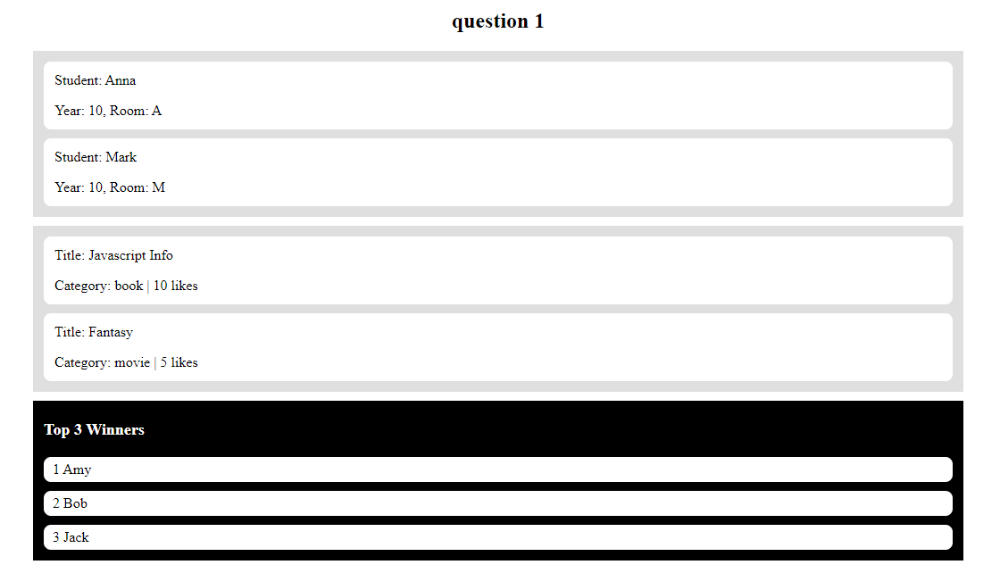
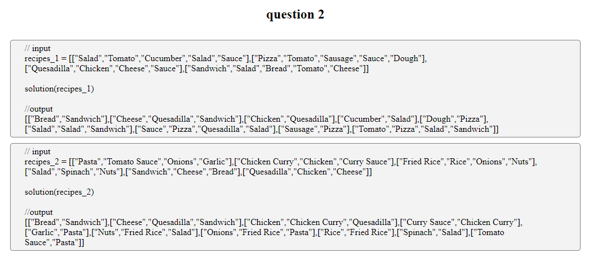
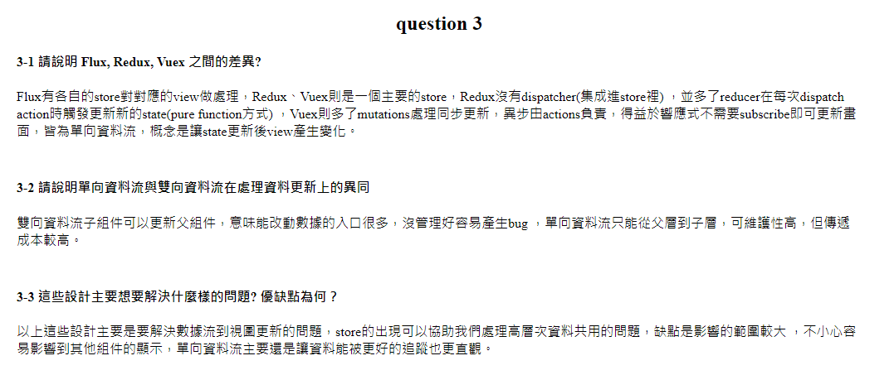

# Pretest (Nuxt 3)

Pretest solution project.

## Setup

Make sure to install the dependencies:

```bash
# yarn
yarn install

# npm
npm install

# pnpm
pnpm install
```

## Development Server

Start the development server on http://localhost:3000

```bash
npm run dev
```

## Screenshot
*****
### Solution 1
  
  
  
### Solution 2

  
  

```ts
function solution (recipes: string[][]) {
  const res: Record<string, string[]> = {}
  recipes.forEach((arr) => {
    let dish: string | null = null
    arr.forEach((recipe, index) => {
      if (index === 0) {
        dish = recipe
      } else if (dish != null) {
        if (res[recipe] == null) {
          res[recipe] = [dish]
        } else {
          res[recipe].push(dish)
        }
      }
    })
  })
  for (let key in res) {
    res[key].sort((a, b) => a.localeCompare(b))
  }
  return Object.keys(res)
    .sort((a, b) => a.localeCompare(b))
    .map((recipe) => [recipe, ...res[recipe]])
}
```
  
### Solution 3
  
  
